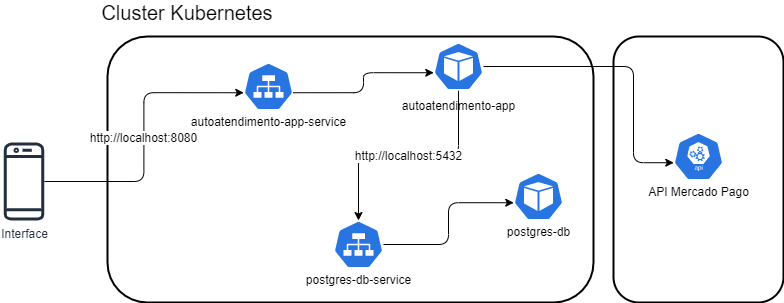

# Tech Challenge Auto Atendimento

## Objetivo
Há uma lanchonete indo muito bem na cidade e em contínua expansão, porém, está lidando com problemas devido a esse crescimento exponencial. Os problemas vão desde o esquecimento de pedidos até pedidos perdidos e mal interpretados, então vemos que ela precisa de uma solução urgente que possibilite a continuidade desse crescimento.

Para que possamos lidar com a grande quantidade de pedidos, iremos criar uma aplicação que será responsável pelo gerenciamento da parte de pedidos da lanchonete.

Essa aplicação serve para um cliente solicitar um pedido de produtos de uma lanchonete a partir de uma interface eletrônica. Ela possui as seguintes funcionalidades para o Estabelecimento e o Cliente interagirem:
 - Cadastro, edição e exclusão de produtos
 - Cadastro e identificação de clientes
 - Cadastro, atualização e consulta de pedidos

## Desenho da arquitetura

Estrutura do cluster Kubernetes da aplicação:

## Guia de utilização da aplicação

Para utilização do sistema de autoatendimento, primeiramente deve-se cadastrar os produtos através dos seguintes endpoints:

| Endpoint                      | Descrição         |
|-------------------------------|-------------------|
| POST /produtos                | Cadastrar produto |
| GET /produtos                 | Listar produtos   |
| PUT /produtos/{id_produto}    | Atualizar produto |
| DELETE /produtos/{id_produto} | Excluir produto   |

Após cadastrar os produtos, para realizar um novo pedido, deve-se utilizar os seguintes endpoints: 

| Endpoint                        | Descrição                    |
|---------------------------------|------------------------------|
| POST /clientes                  | Cadastrar cliente            |
| GET /clientes/{cpf}             | Consulta de cliente por CPF  |
| POST /pedidos                   | Cadastrar pedido             |                             
| PUT /pedidos/{id_pedido}/status | Atualizar status do pedido   | 
| PUT /pedidos                    | Listar pedidos               |                                

E por fim, realizar o pagamento do pedido:

| Endpoint                          | Descrição                               |
|-----------------------------------|-----------------------------------------|
| POST /pagamentos/confirmar        | Realizar pagamento do pedido            |
| GET /pagamentos/pedido/{idPedido} | Consultar status do pagamento do pedido |

# Como executar localmente:
 
## Pré-requisitos:
 - Docker instalado na máquina

## Passo a passo:
 - Executar o docker
 - Abrir um terminal de comandos (git bash por exemplo)
 - Executar o comando: docker build -t autoatendimento:1.0 .
 - Executar o comando: docker-compose up -d
 - Abrir o browser e digitar o seguinte caminho: http://localhost:8080/swagger-ui/index.html
 - Executar os endpoints através da especificação Open API
 ###
 ###
 ### Documentação do sistema (DDD) com Event Storming: https://miro.com/app/board/uXjVKKXvR9g=/
