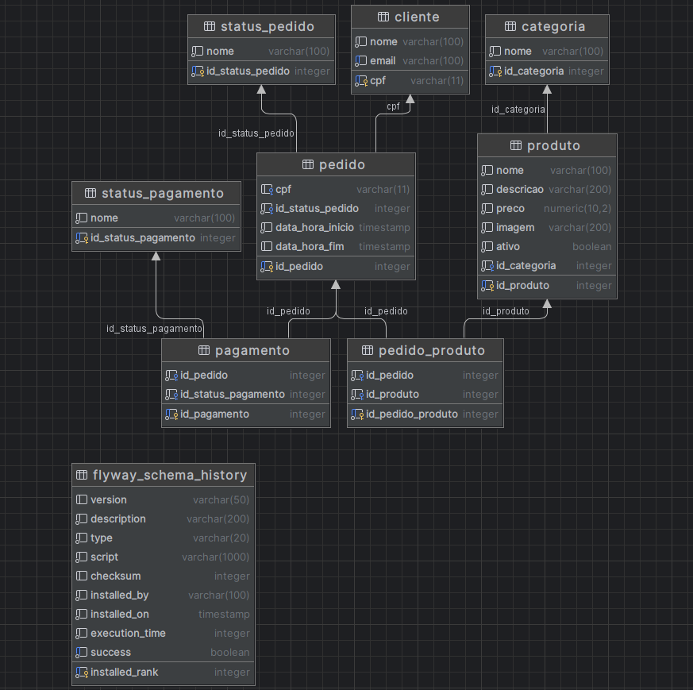

# Tech Challenge Auto Atendimento

## Objetivo
Há uma lanchonete indo muito bem na cidade e em contínua expansão, porém, está lidando com problemas devido a esse crescimento exponencial. Os problemas vão desde o esquecimento de pedidos até pedidos perdidos e mal interpretados, então vemos que ela precisa de uma solução urgente que possibilite a continuidade desse crescimento.

Para que possamos lidar com a grande quantidade de pedidos, iremos criar uma aplicação que será responsável pelo gerenciamento da parte de pedidos da lanchonete.

Essa aplicação serve para um cliente solicitar um pedido de produtos de uma lanchonete a partir de uma interface eletrônica. Ela possui as seguintes funcionalidades para o Estabelecimento e o Cliente interagirem:
 - Cadastro, edição e exclusão de produtos
 - Cadastro e identificação de clientes
 - Cadastro, atualização e consulta de pedidos

## Desenho da arquitetura

Estrutura do cluster Kubernetes da aplicação:


## Guia de utilização da aplicação

Para utilização do sistema de autoatendimento, primeiramente deve-se cadastrar os produtos através dos seguintes endpoints:

| Endpoint                      | Descrição         |
|-------------------------------|-------------------|
| POST /produtos                | Cadastrar produto |
| GET /produtos                 | Listar produtos   |
| PUT /produtos/{id_produto}    | Atualizar produto |
| DELETE /produtos/{id_produto} | Excluir produto   |

Após cadastrar os produtos, para realizar um novo pedido, deve-se utilizar os seguintes endpoints: 

| Endpoint                        | Descrição                    |
|---------------------------------|------------------------------|
| POST /clientes                  | Cadastrar cliente            |
| GET /clientes/{cpf}             | Consulta de cliente por CPF  |
| POST /pedidos                   | Cadastrar pedido             |                             
| PUT /pedidos/{id_pedido}/status | Atualizar status do pedido   | 
| PUT /pedidos                    | Listar pedidos               |                                

E por fim, realizar o pagamento do pedido:

| Endpoint                          | Descrição                               |
|-----------------------------------|-----------------------------------------|
| POST /pagamentos/confirmar        | Realizar pagamento do pedido            |
| GET /pagamentos/pedido/{idPedido} | Consultar status do pagamento do pedido |

# Como executar localmente:

## Com Docker
### Pré-requisitos:
 - Docker instalado na máquina
 - Ngrok instalado na máquina
### Passo a passo:
 - Executar o docker
 - Abrir um terminal de comandos (git bash por exemplo) e vá até a pasta do projeto
 - Executar o comando: docker-compose up -d
 - Executar o comando com o domínio reservado: ngrok http --domain=bold-caring-mole.ngrok-free.app 8080
 - Utilizar a collection do Postman disponível em: **./collection/techchallengeautoatendimento.postman_collection.json**
 - Executar os endpoints no Postman
 
 ## Com Kubernetes
 ### Configuração dos secrets
 1. Crie um arquivo postgres-secret.yaml dentro do diretório ./k8s seguindo o exemplo:
```yaml
apiVersion: v1
kind: Secret
metadata:
  name: postgres-secret
stringData:
  POSTGRES_ROOT_PASSWORD: password
  POSTGRES_DATABASE: autoatendimento
  POSTGRES_USER: postgres
  POSTGRES_PASSWORD: password
```
2. Aplique o arquivo
 ```bash
 kubectl apply -f postgres-secret.yaml
 ```
 ### No diretório /k8s rode os seguintes comandos:
 #### 1 - Configurando o serviço de tunelamento
  ```bash
 ngrok http --domain=bold-caring-mole.ngrok-free.app 8080
 ```
 #### 2 - Configurando o Banco de Dados
 ```bash
 kubectl apply -f postgres_deployment.yaml
 ```
 #### 3 - Criando o deployment da aplicação
 ```bash
 kubectl apply -f app_deployment.yaml
 ```
 #### 4 - Aplicando o metrics
 ```bash
 kubectl apply -f metrics.yaml
 ```
 #### 5 - Aplicando o HPA
 ```bash
 kubectl apply -f app_hpa.yaml
 ```
 6 - Caso esteja utilizando o minikube no WSL2, utilize o seguinte comando para direcionar as requisições:
 ```bash
 kubectl port-forward svc/autoatendimento-app-service 8080:8080
 ```
 ### Documentação do sistema (DDD) com Event Storming: https://miro.com/app/board/uXjVKKXvR9g=/
 ### Link do vídeo no youtube demonstrando o funcionamento do kubernetes: https://www.youtube.com/watch?v=AqKuZsq5wAE

 ### A Collection to postman está em ``./collection``

 # Banco de Dados
 ### ERD
 
### Melhorias
#### Adição de índices na tabela:
 Para melhorar a performance de queries SQL. Agora, além do cpf do usuário ser uma chave indexada, o email também é. Isso ajuda a melhorar a performance de verificação de conflito de usuários.

#### Versionamento do Banco de Dados: 
Nessa versão da aplicação foi adicionado o "flyway" para que possamos versionar o banco de dados e também o utilizei para inserir alguns dados iniciais para testes de forma mais segura.